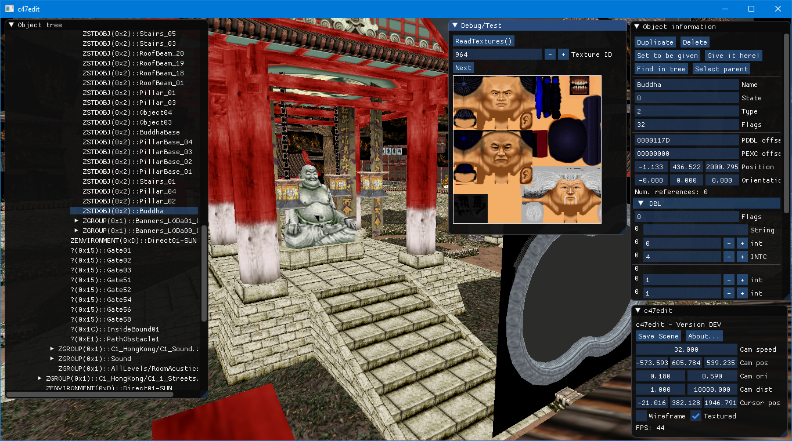

# c47edit

A scene editor for Hitman: Codename 47.

Licensed under the GPL 3.

[Download compiled release](https://github.com/AdrienTD/c47edit/releases)

## Usage

See the [help.md](docs/help.md) file.

## Compiling

The program requires Visual Studio 2017 (with latest update) or a more recent version (as it's using some C++17 features) to be compiled and will only work on Windows.

* If you have Visual Studio 2017, you can open the project files that are included in this repository to compile the program.
<!--- * Or you can also use the Visual Studio command prompt and run the **build.bat** file to build the editor. -->

## Libraries used

* [Dear ImGui](https://github.com/ocornut/imgui) (MIT license) for the GUI
* [Miniz](https://github.com/richgel999/miniz) (MIT license) for ZIP archive (de)compression
