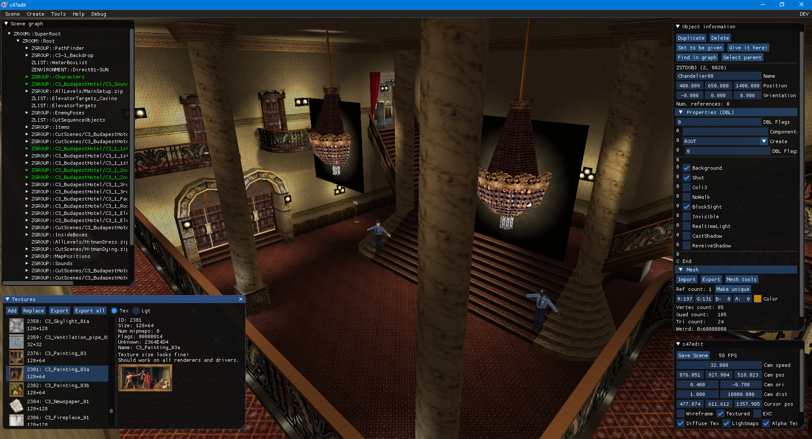

# c47edit

A scene editor for Hitman: Codename 47.

Work in progress!

Licensed under the GPL 3.

[Download compiled release](https://github.com/AdrienTD/c47edit/releases)

## Usage

See the [Start Guide](https://github.com/AdrienTD/c47edit/wiki/Start-Guide) on the wiki for how to set up the editor and the basics.

## Compiling

The program requires Visual Studio 2017 (with latest update) or a more recent version (as it's using some C++17 features) to be compiled and will only work on Windows.

* First you need to have [vcpkg](https://vcpkg.io) installed.
* Ensure you have Visual Studio integration enabled with: `vcpkg integrate install`
* Then install the necessary packages with: `vcpkg install miniz nlohmann-json stb libsquish glew assimp`
* Now you can open the project file in Visual Studio and compile the program.

## Libraries used

* [Dear ImGui](https://github.com/ocornut/imgui) (MIT license) for the GUI
* [Miniz](https://github.com/richgel999/miniz) (MIT license) for ZIP archive (de)compression
* [JSON for Modern C++](https://github.com/nlohmann/json) (MIT license) for JSON parsing
* [stb](https://github.com/nothings/stb) (public domain) for image reading/writing
* [libsquish](https://sourceforge.net/projects/libsquish/) (MIT license) for DXT/S3TC texture compression
* [glew](https://github.com/nigels-com/glew) (BSD3 license) for access to OpenGL APIs
* [assimp](https://github.com/assimp/assimp) (BSD3 license) for 3D model import from and export to various file formats
* [ImGuizmo](https://github.com/CedricGuillemet/ImGuizmo) (MIT license) for the Transform Gizmo